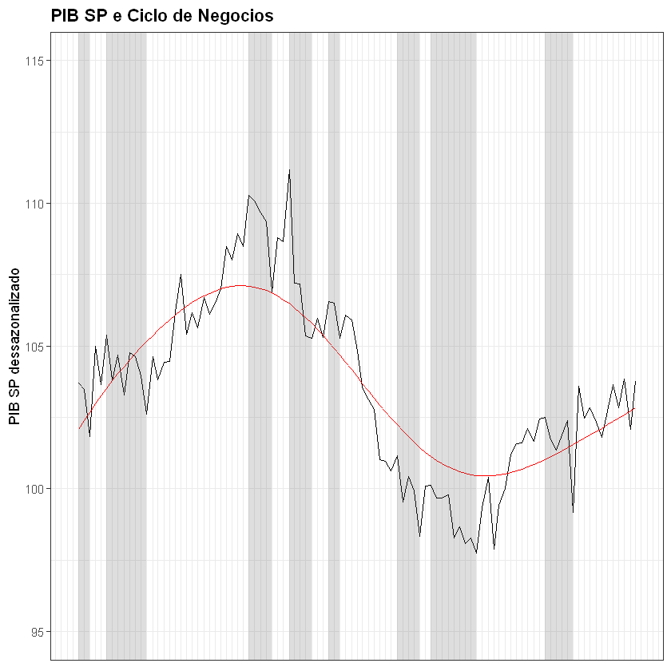
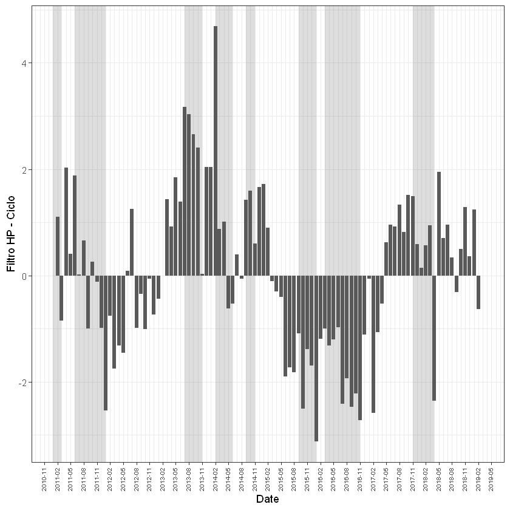
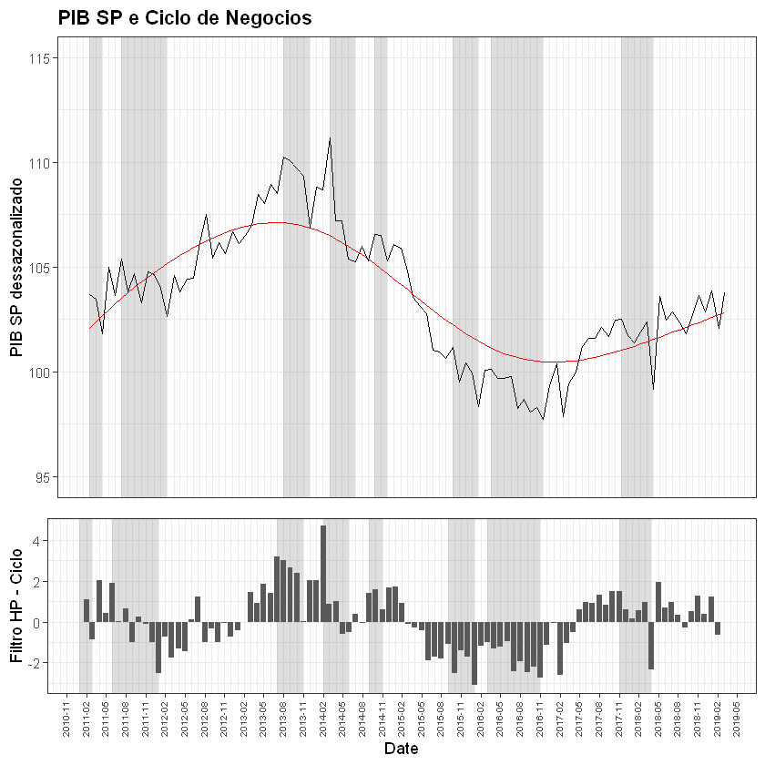

# Ciclo de Negócios - PIB SP

Para a execução do código são necessários os pacotes instalados com o seguinte comando:
install.packages(c("mFilter", "BCDating", "tidyverse", "ggfortify", "gridExtra", "zoo"))
## 1. Carregamento de pacotes necessários


```R
library(mFilter)
library(BCDating)
library(ggplot2)
library(ggfortify)
library(gridExtra)
library(zoo)
```

O pacote `zoo` é necessário para a conversão de datas de objetos `ts`.

## 2. Carregamento os dados

Dados do PIB mensal paulista da [Fundação SEADE](http://www.seade.gov.br/).

O código abaixo carrega os dados do PIB mensal no arquivo PIBSPDESMENSAL.txt e transforma num objeto `ts` do R.


```R
PIBSPDESMENSAL <- read.table("PIBSPDESMENSAL.txt", header = 1)
pibspdes.ts <- ts(PIBSPDESMENSAL[,1], start = c(2002, 1), freq = 12)
pibspdes.ts
```


<table>
<caption>A Time Series: 18 × 12</caption>
<thead>
	<tr><th></th><th scope=col>Jan</th><th scope=col>Feb</th><th scope=col>Mar</th><th scope=col>Apr</th><th scope=col>May</th><th scope=col>Jun</th><th scope=col>Jul</th><th scope=col>Aug</th><th scope=col>Sep</th><th scope=col>Oct</th><th scope=col>Nov</th><th scope=col>Dec</th></tr>
</thead>
<tbody>
	<tr><th scope=row>2002</th><td> 73.33478</td><td> 73.06779</td><td> 73.64706</td><td> 71.76099</td><td> 70.93057</td><td> 70.97745</td><td> 69.59280</td><td> 69.97219</td><td> 71.06672</td><td> 71.05543</td><td> 68.92039</td><td> 70.46595</td></tr>
	<tr><th scope=row>2003</th><td> 70.25221</td><td> 69.91517</td><td> 70.06311</td><td> 70.19920</td><td> 70.42013</td><td> 70.38047</td><td> 71.24865</td><td> 71.89990</td><td> 73.40967</td><td> 72.77346</td><td> 72.00712</td><td> 72.95622</td></tr>
	<tr><th scope=row>2004</th><td> 72.99799</td><td> 74.67012</td><td> 74.62521</td><td> 74.61258</td><td> 75.67317</td><td> 75.66943</td><td> 75.87418</td><td> 76.60303</td><td> 75.89974</td><td> 76.03392</td><td> 77.05789</td><td> 76.92885</td></tr>
	<tr><th scope=row>2005</th><td> 77.58925</td><td> 77.85808</td><td> 77.65135</td><td> 78.17482</td><td> 78.46795</td><td> 78.62313</td><td> 78.94936</td><td> 78.86570</td><td> 78.64828</td><td> 80.32922</td><td> 80.18617</td><td> 80.88479</td></tr>
	<tr><th scope=row>2006</th><td> 80.74956</td><td> 80.28435</td><td> 80.90182</td><td> 81.09761</td><td> 80.63397</td><td> 81.48458</td><td> 81.74595</td><td> 81.56003</td><td> 82.69094</td><td> 83.25254</td><td> 83.89853</td><td> 84.22039</td></tr>
	<tr><th scope=row>2007</th><td> 84.80598</td><td> 83.96821</td><td> 86.27099</td><td> 87.28801</td><td> 87.49391</td><td> 87.84886</td><td> 89.03589</td><td> 89.68530</td><td> 90.02649</td><td> 89.50613</td><td> 90.84226</td><td> 90.72636</td></tr>
	<tr><th scope=row>2008</th><td> 88.66001</td><td> 92.33906</td><td> 92.11330</td><td> 93.19064</td><td> 94.07928</td><td> 95.24395</td><td> 94.17783</td><td> 96.54803</td><td> 94.11640</td><td> 93.53354</td><td> 88.83879</td><td> 88.33278</td></tr>
	<tr><th scope=row>2009</th><td> 90.14950</td><td> 88.96092</td><td> 91.34150</td><td> 91.45888</td><td> 92.15164</td><td> 93.11597</td><td> 93.56399</td><td> 94.96909</td><td> 96.08541</td><td> 97.84143</td><td> 96.93722</td><td> 99.22027</td></tr>
	<tr><th scope=row>2010</th><td> 98.66773</td><td> 99.52808</td><td> 99.44595</td><td> 98.74035</td><td>100.17127</td><td> 98.90729</td><td>101.86711</td><td>100.11137</td><td>100.89978</td><td>101.18079</td><td>101.65303</td><td>102.72070</td></tr>
	<tr><th scope=row>2011</th><td>103.69311</td><td>103.49000</td><td>101.83190</td><td>104.99832</td><td>103.64968</td><td>105.39131</td><td>103.80004</td><td>104.68971</td><td>103.27766</td><td>104.76684</td><td>104.62375</td><td>103.97065</td></tr>
	<tr><th scope=row>2012</th><td>102.62789</td><td>104.61862</td><td>103.81797</td><td>104.43381</td><td>104.47445</td><td>106.18359</td><td>107.49942</td><td>105.41123</td><td>106.18121</td><td>105.63915</td><td>106.69299</td><td>106.12409</td></tr>
	<tr><th scope=row>2013</th><td>106.50347</td><td>107.00528</td><td>108.48911</td><td>108.01314</td><td>108.95287</td><td>108.50516</td><td>110.26984</td><td>110.09879</td><td>109.66959</td><td>109.34650</td><td>106.88631</td><td>108.79727</td></tr>
	<tr><th scope=row>2014</th><td>108.66700</td><td>111.18375</td><td>107.20996</td><td>107.18646</td><td>105.36554</td><td>105.26512</td><td>105.98165</td><td>105.31337</td><td>106.57447</td><td>106.50425</td><td>105.27362</td><td>106.09808</td></tr>
	<tr><th scope=row>2015</th><td>105.90576</td><td>104.82888</td><td>103.57051</td><td>103.12076</td><td>102.77488</td><td>101.02893</td><td>100.96674</td><td>100.63923</td><td>101.15105</td><td> 99.52379</td><td>100.43213</td><td> 99.93101</td></tr>
	<tr><th scope=row>2016</th><td> 98.32905</td><td>100.09144</td><td>100.13205</td><td> 99.67750</td><td> 99.66865</td><td> 99.79342</td><td> 98.27034</td><td> 98.67453</td><td> 98.07267</td><td> 98.28473</td><td> 97.74856</td><td> 99.34015</td></tr>
	<tr><th scope=row>2017</th><td>100.39278</td><td> 97.88011</td><td> 99.43144</td><td>100.00270</td><td>101.19828</td><td>101.58511</td><td>101.61454</td><td>102.10672</td><td>101.66481</td><td>102.44880</td><td>102.51445</td><td>101.71462</td></tr>
	<tr><th scope=row>2018</th><td>101.36487</td><td>101.89256</td><td>102.37728</td><td> 99.18121</td><td>103.60518</td><td>102.47171</td><td>102.84375</td><td>102.33969</td><td>101.81237</td><td>102.74005</td><td>103.65017</td><td>102.84418</td></tr>
	<tr><th scope=row>2019</th><td>103.84362</td><td>102.08969</td><td>103.76201</td><td>         </td><td>         </td><td>         </td><td>         </td><td>         </td><td>         </td><td>         </td><td>         </td><td>         </td></tr>
</tbody>
</table>


## 3. Aplicação da função de datação de ciclos de negócios

Para obter a datação de ciclo de negócios é aplicada a função `BBQ`. A função `BBQ`, do pacote `BCDating` recebe o objeto de série temporal com valores transformados em logaritmo e multiplicado por 100, retornando um objeto com as datas de início e fim dos ciclos. O objeto retornado é atribuído à variável `dc`.

Para plotar os dados com o `ggplot2` é conveniente que estejam no formato de dataframe. Por isso constrói-se um dataframe atribuindo-o à variável `business.cycle`.


```R
dc <- BBQ(
    log(pibspdes.ts)*100,
    name="Dating Business Cycles of LOG PIBSP DESSAZONALIZADO")

a <- c(as.Date(dc@y)[1], as.Date(dc@y)[dc@peaks])
b <- as.Date(dc@y)[dc@troughs]
business.cycle <- data.frame(Topo=a, Vale=b)
business.cycle
```


<table>
<caption>A data.frame: 16 × 2</caption>
<thead>
	<tr><th scope=col>Topo</th><th scope=col>Vale</th></tr>
	<tr><th scope=col>&lt;date&gt;</th><th scope=col>&lt;date&gt;</th></tr>
</thead>
<tbody>
	<tr><td>2002-01-01</td><td>2002-11-01</td></tr>
	<tr><td>2003-09-01</td><td>2003-11-01</td></tr>
	<tr><td>2004-02-01</td><td>2004-04-01</td></tr>
	<tr><td>2005-07-01</td><td>2005-09-01</td></tr>
	<tr><td>2005-12-01</td><td>2006-02-01</td></tr>
	<tr><td>2007-11-01</td><td>2008-01-01</td></tr>
	<tr><td>2008-08-01</td><td>2008-12-01</td></tr>
	<tr><td>2010-02-01</td><td>2010-04-01</td></tr>
	<tr><td>2011-01-01</td><td>2011-03-01</td></tr>
	<tr><td>2011-06-01</td><td>2012-01-01</td></tr>
	<tr><td>2013-07-01</td><td>2013-11-01</td></tr>
	<tr><td>2014-02-01</td><td>2014-06-01</td></tr>
	<tr><td>2014-09-01</td><td>2014-11-01</td></tr>
	<tr><td>2015-09-01</td><td>2016-01-01</td></tr>
	<tr><td>2016-03-01</td><td>2016-11-01</td></tr>
	<tr><td>2017-11-01</td><td>2018-04-01</td></tr>
</tbody>
</table>


## 4. Aplicação o Filtro HP

Para obter os componentes `Trend` e `Cycle` do PIB paulista utiliza-se a função `hpfilter`, que recebe como argumento a série temporal do PIB.

Semelhante ao caso anterior, é conveniente que os dados estejam na forma de dataframe, nesse caso atribuído à variável `pibspdes.ts`.


```R
pibsphp <- hpfilter(pibspdes.ts, freq = 14400, type = c("lambda"), drift = FALSE)
a <- cbind(pibsphp$x, pibsphp$trend, pibsphp$cycle)
pibspdes.ts <- data.frame(as.matrix(a), as.Date(as.yearmon(time(a))))
colnames(pibspdes.ts) <- c("PIB", "Trend", "Cycle", "Date")
pibspdes.ts
```


<table>
<caption>A data.frame: 207 × 4</caption>
<thead>
	<tr><th scope=col>PIB</th><th scope=col>Trend</th><th scope=col>Cycle</th><th scope=col>Date</th></tr>
	<tr><th scope=col>&lt;dbl&gt;</th><th scope=col>&lt;dbl&gt;</th><th scope=col>&lt;dbl&gt;</th><th scope=col>&lt;date&gt;</th></tr>
</thead>
<tbody>
	<tr><td>73.33478</td><td>70.05551</td><td> 3.27926554</td><td>2002-01-01</td></tr>
	<tr><td>73.06779</td><td>70.15481</td><td> 2.91297373</td><td>2002-02-01</td></tr>
	<tr><td>73.64706</td><td>70.25435</td><td> 3.39270943</td><td>2002-03-01</td></tr>
	<tr><td>71.76099</td><td>70.35454</td><td> 1.40645848</td><td>2002-04-01</td></tr>
	<tr><td>70.93057</td><td>70.45605</td><td> 0.47451734</td><td>2002-05-01</td></tr>
	<tr><td>70.97745</td><td>70.55965</td><td> 0.41780225</td><td>2002-06-01</td></tr>
	<tr><td>69.59280</td><td>70.66613</td><td>-1.07333531</td><td>2002-07-01</td></tr>
	<tr><td>69.97219</td><td>70.77632</td><td>-0.80413185</td><td>2002-08-01</td></tr>
	<tr><td>71.06672</td><td>70.89097</td><td> 0.17574440</td><td>2002-09-01</td></tr>
	<tr><td>71.05543</td><td>71.01078</td><td> 0.04465433</td><td>2002-10-01</td></tr>
	<tr><td>68.92039</td><td>71.13644</td><td>-2.21605346</td><td>2002-11-01</td></tr>
	<tr><td>70.46595</td><td>71.26868</td><td>-0.80272306</td><td>2002-12-01</td></tr>
	<tr><td>70.25221</td><td>71.40804</td><td>-1.15582981</td><td>2003-01-01</td></tr>
	<tr><td>69.91517</td><td>71.55503</td><td>-1.63986164</td><td>2003-02-01</td></tr>
	<tr><td>70.06311</td><td>71.71007</td><td>-1.64696014</td><td>2003-03-01</td></tr>
	<tr><td>70.19920</td><td>71.87346</td><td>-1.67426184</td><td>2003-04-01</td></tr>
	<tr><td>70.42013</td><td>72.04540</td><td>-1.62527056</td><td>2003-05-01</td></tr>
	<tr><td>70.38047</td><td>72.22596</td><td>-1.84549141</td><td>2003-06-01</td></tr>
	<tr><td>71.24865</td><td>72.41511</td><td>-1.16645522</td><td>2003-07-01</td></tr>
	<tr><td>71.89990</td><td>72.61268</td><td>-0.71277378</td><td>2003-08-01</td></tr>
	<tr><td>73.40967</td><td>72.81842</td><td> 0.59125408</td><td>2003-09-01</td></tr>
	<tr><td>72.77346</td><td>73.03204</td><td>-0.25857609</td><td>2003-10-01</td></tr>
	<tr><td>72.00712</td><td>73.25328</td><td>-1.24616043</td><td>2003-11-01</td></tr>
	<tr><td>72.95622</td><td>73.48187</td><td>-0.52565286</td><td>2003-12-01</td></tr>
	<tr><td>72.99799</td><td>73.71746</td><td>-0.71946359</td><td>2004-01-01</td></tr>
	<tr><td>74.67012</td><td>73.95964</td><td> 0.71048286</td><td>2004-02-01</td></tr>
	<tr><td>74.62521</td><td>74.20797</td><td> 0.41724415</td><td>2004-03-01</td></tr>
	<tr><td>74.61258</td><td>74.46205</td><td> 0.15052586</td><td>2004-04-01</td></tr>
	<tr><td>75.67317</td><td>74.72152</td><td> 0.95164762</td><td>2004-05-01</td></tr>
	<tr><td>75.66943</td><td>74.98602</td><td> 0.68341286</td><td>2004-06-01</td></tr>
	<tr><td>...</td><td>...</td><td>...</td><td>...</td></tr>
	<tr><td> 98.28473</td><td>100.4987</td><td>-2.21394779</td><td>2016-10-01</td></tr>
	<tr><td> 97.74856</td><td>100.4694</td><td>-2.72082994</td><td>2016-11-01</td></tr>
	<tr><td> 99.34015</td><td>100.4547</td><td>-1.11458449</td><td>2016-12-01</td></tr>
	<tr><td>100.39278</td><td>100.4541</td><td>-0.06127485</td><td>2017-01-01</td></tr>
	<tr><td> 97.88011</td><td>100.4666</td><td>-2.58650647</td><td>2017-02-01</td></tr>
	<tr><td> 99.43144</td><td>100.4917</td><td>-1.06021854</td><td>2017-03-01</td></tr>
	<tr><td>100.00270</td><td>100.5283</td><td>-0.52558145</td><td>2017-04-01</td></tr>
	<tr><td>101.19828</td><td>100.5755</td><td> 0.62281080</td><td>2017-05-01</td></tr>
	<tr><td>101.58511</td><td>100.6322</td><td> 0.95290819</td><td>2017-06-01</td></tr>
	<tr><td>101.61454</td><td>100.6975</td><td> 0.91706532</td><td>2017-07-01</td></tr>
	<tr><td>102.10672</td><td>100.7704</td><td> 1.33633192</td><td>2017-08-01</td></tr>
	<tr><td>101.66481</td><td>100.8501</td><td> 0.81475222</td><td>2017-09-01</td></tr>
	<tr><td>102.44880</td><td>100.9357</td><td> 1.51307866</td><td>2017-10-01</td></tr>
	<tr><td>102.51445</td><td>101.0267</td><td> 1.48777030</td><td>2017-11-01</td></tr>
	<tr><td>101.71462</td><td>101.1223</td><td> 0.59230373</td><td>2017-12-01</td></tr>
	<tr><td>101.36487</td><td>101.2221</td><td> 0.14273022</td><td>2018-01-01</td></tr>
	<tr><td>101.89256</td><td>101.3257</td><td> 0.56688669</td><td>2018-02-01</td></tr>
	<tr><td>102.37728</td><td>101.4325</td><td> 0.94479678</td><td>2018-03-01</td></tr>
	<tr><td> 99.18121</td><td>101.5421</td><td>-2.36093715</td><td>2018-04-01</td></tr>
	<tr><td>103.60518</td><td>101.6543</td><td> 1.95086139</td><td>2018-05-01</td></tr>
	<tr><td>102.47171</td><td>101.7685</td><td> 0.70322306</td><td>2018-06-01</td></tr>
	<tr><td>102.84375</td><td>101.8843</td><td> 0.95946876</td><td>2018-07-01</td></tr>
	<tr><td>102.33969</td><td>102.0014</td><td> 0.33832128</td><td>2018-08-01</td></tr>
	<tr><td>101.81237</td><td>102.1195</td><td>-0.30713322</td><td>2018-09-01</td></tr>
	<tr><td>102.74005</td><td>102.2384</td><td> 0.50160562</td><td>2018-10-01</td></tr>
	<tr><td>103.65017</td><td>102.3579</td><td> 1.29224780</td><td>2018-11-01</td></tr>
	<tr><td>102.84418</td><td>102.4777</td><td> 0.36644926</td><td>2018-12-01</td></tr>
	<tr><td>103.84362</td><td>102.5977</td><td> 1.24589173</td><td>2019-01-01</td></tr>
	<tr><td>102.08969</td><td>102.7178</td><td>-0.62812602</td><td>2019-02-01</td></tr>
	<tr><td>103.76201</td><td>102.8380</td><td> 0.92405246</td><td>2019-03-01</td></tr>
</tbody>
</table>


## 5. Plotando os dados

Para plotar os dados utiliza-se o pacote `ggplot2`. Abaixo são salvas algumas variáveis que serão usadas nas configurações dos gráficos.


```R
plot.limits <- as.Date(c("2010-12-31", "2019-03-02"))
plot.date_breaks <- "3 month"
plot.date_minor_breaks <- "1 month"
xscale.date.size <- 6
```

Para plotar o gráfico usa-se a função `ggplot` com a série temporal `pibspdes.ts` e a coluna `Date` como o eixo `x`.

Para que os dados apareçam no gráfico adiciona-se (+) à saída da função `ggplot` os chamados 'geomas', dizendo como devem ser apresentados os dados.


```R
g1 <- ggplot(pibspdes.ts, aes(x = Date)) +
    geom_line(aes(y = PIB), color = "black") +
    geom_line(aes(y = Trend), color = "red") + 
    ylim(95, 115) +
    geom_rect(
        data = business.cycle,
        inherit.aes = FALSE,
        aes(xmin = Topo, xmax = Vale, ymin = -Inf, ymax = Inf),
        alpha = 0.2) +
    theme_bw() +
    scale_x_date(
        date_labels = "%Y-%m",
        date_breaks = plot.date_breaks,
        date_minor_breaks = plot.date_minor_breaks,
        limits = plot.limits) +
    ylab("PIB SP dessazonalizado") +
    ggtitle("PIB SP e Ciclo de Negocios") +
    theme(
        axis.title.x = element_blank(),
        axis.text.x = element_blank(),
        axis.ticks.x = element_blank(),
        plot.title = element_text(lineheight = .8, face = "bold"))
g1
```

    Warning message:
    "Removed 108 rows containing missing values (geom_path)."Warning message:
    "Removed 108 rows containing missing values (geom_path)."Warning message:
    "Removed 8 rows containing missing values (geom_rect)."





```R
g2 <- ggplot(pibspdes.ts, aes(x = Date, y = Cycle)) +
    geom_col() +
    geom_rect(
        data = business.cycle,
        inherit.aes=FALSE,
        aes(xmin = Topo, xmax = Vale, ymin = -Inf, ymax = Inf),
        alpha = 0.2) +
    theme_bw() +
    scale_x_date(
        date_labels = "%Y-%m",
        date_breaks = plot.date_breaks,
        date_minor_breaks = plot.date_minor_breaks,
        limits = plot.limits) +
    ylab("Filtro HP - Ciclo") +
    theme(
        axis.text.x = element_text(
            angle = 90, 
            vjust = 0.25, 
            size = xscale.date.size))
g2
```

    Warning message:
    "Removed 108 rows containing missing values (position_stack)."Warning message:
    "Removed 2 rows containing missing values (geom_col)."Warning message:
    "Removed 8 rows containing missing values (geom_rect)."





Para que os gráficos fiquem numa única figura usa-se a função `grid.arrange`.


```R
g <- grid.arrange(g1, g2, ncol = 1, heights = c(2, 1))
g
```

    Warning message:
    "Removed 108 rows containing missing values (geom_path)."Warning message:
    "Removed 108 rows containing missing values (geom_path)."Warning message:
    "Removed 8 rows containing missing values (geom_rect)."Warning message:
    "Removed 108 rows containing missing values (position_stack)."Warning message:
    "Removed 2 rows containing missing values (geom_col)."Warning message:
    "Removed 8 rows containing missing values (geom_rect)."


    TableGrob (2 x 1) "arrange": 2 grobs
      z     cells    name           grob
    1 1 (1-1,1-1) arrange gtable[layout]
    2 2 (2-2,1-1) arrange gtable[layout]





```R
ggsave(file = "plot.png", plot = g, width = 18, height = 9, dpi = 300)
```
